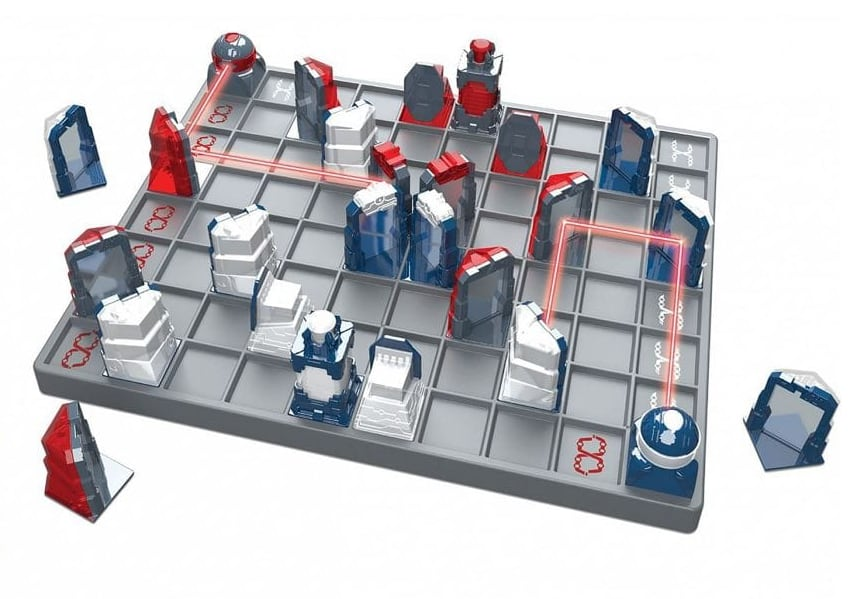

# Laser Chess

[](https://forthebadge.com)

### STATUS :warning: _Not ready!_

## About

A board game made with JavaScript (with the help of ReactJS).

-   [`(📄) Read the Guide`](docs/Guide.md)
-   [`(📄) Read the Algebraic Notation (AN)`](docs/AlgebraicNotation.md)
-   [`(📄) Read the Setup Notation (SN)`](docs/SetupNotation.md)
-   [`(📄) Read the Laser Hit Action Notation (LHAN)`](docs/LaserHitActionNotation.md)

## Background

Laser Chess combines the fun of bending lasers and illuminating pieces with chess-like strategy. You have to strike your opponent’s King while protecting your own from getting zapped! Simple rules and only a few basic moves make Laser Chess easy to learn and quick to play.


[`(📄 PDF) How to play`](https://www.thinkfun.com/wp-content/uploads/2017/10/LaserCh-1034-Instructions.pdf)

## Contributing

##### Bug Reports & Feature Requests

Please use the issue tracker to report any bugs or file feature requests.

##### Developing

PRs are welcome. To begin developing, do this:

```bash
$ git clone git@github.com:kishannareshpal/laserchess.git
$ cd laserchess/
$ npm install
$ npm start
```
